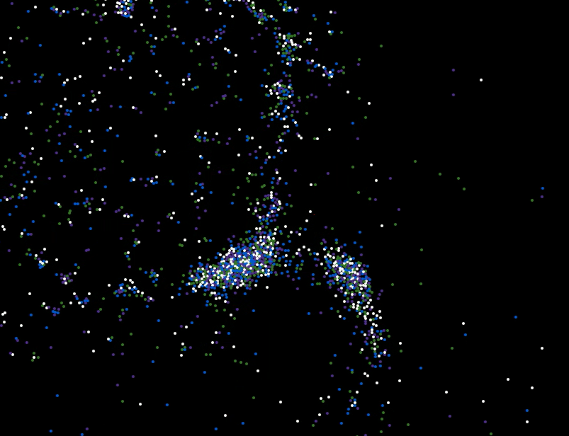

Multithreaded real-time molecular dynamics simulator
===

Uses a quadtree and the Barnes Hut algorithm for long-ranged forces, and uses a grid for short-ranged repulsion forces.
Requires SDL2, SDL2-image, and the glm mathematics library.

```sudo apt-get install libsdl2-dev libsdl2-image-dev libglm-dev```

"make run" should compile everything and run!

This was written in 2015 and the multithreading code was thrown together quickly, so don't expect the best code!


